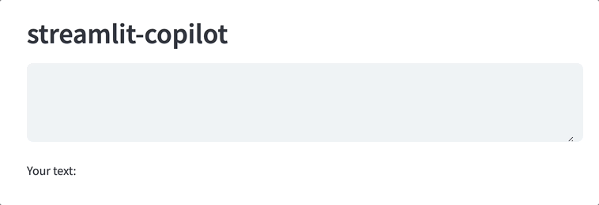
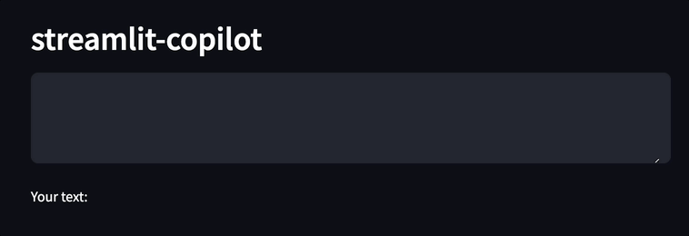

# Streamlit Copilot





To run the component locally:
1. Ensure that you have correct versions of Node and NPM installed:
- npm version: `6.14.13`
- node version: `14.17.3`
2. Run the following command in the root directory of the project:
```
cd component/frontend
npm install
npm run start
```
3. Create venv
4. Install streamlit
```
pip install streamlit
```
5. In `component/__init__.py` file:
- replace `"YOUR_API_URL"` with the actual URL of the API that provides LLM text completion responses ([example](https://llama-cpp-python.readthedocs.io/en/latest/install/macos/))
- set `_RELEASE = False`
6. Run the following command in the root directory of the project (in a separate terminal):
```
streamlit run component/__init__.py
```
